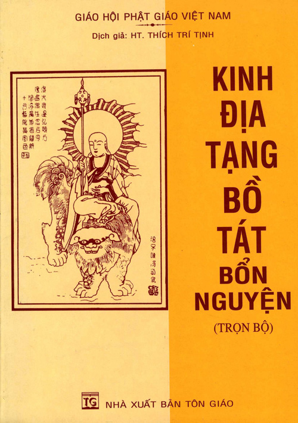

# Giới thiệu {- #gioi-thieu}

  
Hán dịch: Tam Tạng Pháp Sư Pháp Đăng  
Việt dịch: Hòa thượng Thích Trí Tịnh

Mục lục  

[Nghi thức trì tụng](#nghi-thuc-tri-tung)  

Quyển Thượng  
  
[1. Thần thông trên cung trời Đao Lợi](#than-thong-tren-cung-troi-dao-loi)  
[2. Phân thân tập hội](#phan-than-tap-hoi)  
[3. Quán chúng sanh nghiệp duyên](#quan-chung-sanh-nghiep-duyen)  
[4. Nghiệp cảm của chúng sanh](#nghiep-cam-cua-chung-sanh)  
  
Quyển Trung  
  
[5. Danh hiệu của địa ngục](#danh-hieu-cua-dia-nguc)  
[6. Như Lai tán thán](#nhu-lai-tan-than)  
[7. Lợi ích cả kẻ còn người mất](#loi-ich-ca-ke-con-nguoi-mat)  
[8. Các vua Diêm La khen ngợi](#cac-vua-diem-la-khen-ngoi)  
[9. Xưng danh hiệu chư Phật](#xung-danh-hieu-chu-phat)  
  
Quyển Hạ  
  
[10. So sánh nhơn duyên công đức của sự bố thí](#so-sanh-nhon-duyen-cong-duc-cua-su-bo-thi)  
[11. Địa thần hộ pháp](#dia-than-ho-phap)  
[12. Thấy nghe được lợi ích](#thay-nghe-duoc-loi-ich)  
[13. Dặn dò cứu độ nhơn thiên](#dan-do-cuu-do-nhon-thien)  

[Phẩm hồi hướng](#pham-hoi-huong)  
  
  
Download:  

- [EPUB](kinh-dia-tang.epub)
- [PDF](kinh-dia-tang.pdf)

Hoan nghênh chia sẻ, phổ biến!  
______  
<small>Lưu ý: Có thể ấn vào biểu tượng chữ "A" phía trên cùng để điều chỉnh giao diện, phông chữ theo ý muốn.</small>
